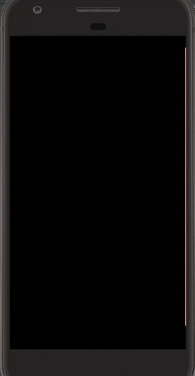

# Remote control 

 
# the application implements following fucntions:
## 1.splash scrren
## 2.two fragments and scroll change,when first enter application will check whether there is ir device inside your phone(because I don't have,so even you don't have ir,you can also do the operation) 
## 3.one displays the model types of device,when you click item,it will toast a text of the type.
## 4.if you want to control air-conditon,you should click the switch button firt,and if you want to turn it off,click it again.
###5.the other implements ImageView and Button click events.images mean the mode,speed and direction,buttons are for changing temperature. They can change when clicked.
## 6.IR is applied.
#
#
##Problems not solved:
###1.different remoter has different code rules,for each of them,I should recode and define them,I just find one type,but I don't konw what kind of air-conditioner it could remote
###2.the code rules are owned by Supplier personally,there is not data on the Internet,so I don't realize the remoting...so sad.
###3.what's more,ifit is implementated,it can only control one specific device which has the same type. 